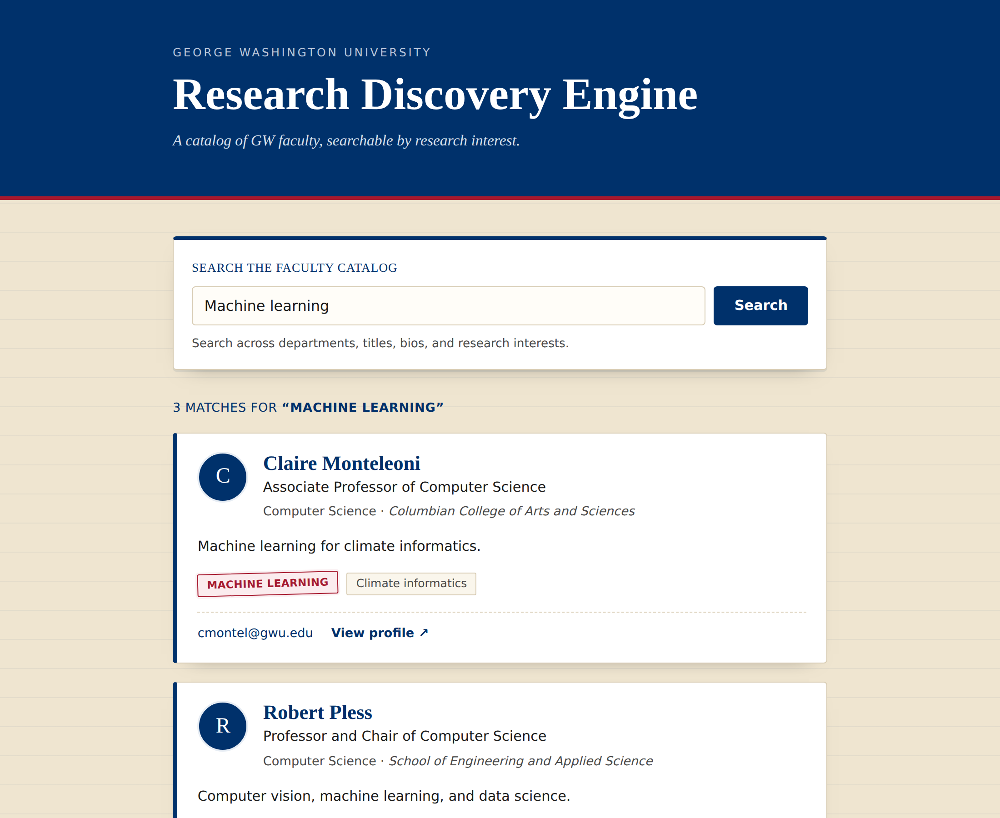
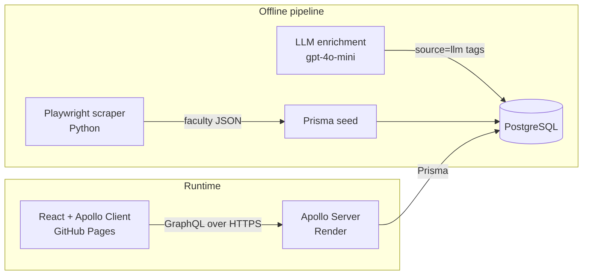

# GWU Research Discovery Engine

[](https://github.com/Prakruthi19/gwu-research-discovery-engine/actions/workflows/ci-cd.yml)

Find George Washington University faculty by what they research. Type a field
like *machine learning* or *public health* and get back a catalog of matching
professors, with the exact research interests that matched stamped on each card.

**Live demo:** _add your GitHub Pages URL here after the first deploy_ ·
**API explorer:** _add your Render URL here_ (Apollo Sandbox)



## Why it's interesting

GWU has no single faculty API. Data lives on one research portal plus ~15
school directory sites with different markup, and only some faculty are tagged
with research interests at all. This project builds the whole pipeline:

1. **Scrape** a config-driven Playwright crawler normalizes all of those
   sites into one dataset ([`scraper/`](scraper)).
2. **Enrich** an LLM pass infers interests for the faculty the scraper couldn't
   tag, with provenance and confidence stored per tag so it can be rolled back
   ([details](docs/llm-enrichment.md)).
3. **Serve** a GraphQL API (Apollo Server + Prisma + PostgreSQL) whose search
   returns not just *who* matched but *why* (`matchedInterests`).
4. **Explore** a React client designed as a library card catalog, with
   shareable search URLs and keyboard-accessible, mobile-friendly UI.

## Architecture



| Layer    | Stack |
|----------|-------|
| Scraper  | Python 3.11, Playwright, config-driven selector strategies |
| API      | Node 22, Apollo Server 5, GraphQL, Prisma 6 |
| Database | PostgreSQL 16 (Neon in production) |
| Client   | React 19, Vite, Apollo Client 4, hand-written CSS |
| CI/CD    | GitHub Actions, GitHub Pages, Render, Dependabot |

## Design decisions

- **GraphQL is only the contract.** Resolvers call Prisma; Prisma owns the
  database. Swapping the data layer wouldn't touch the schema.
- **No N+1 queries.** A shared Prisma `include` eager-loads faculty interests in
  a constant number of SQL statements (DataLoader is the documented next step).
- **Explicit join table** (`FacultyResearchInterest`) so each faculty↔interest
  link carries `source` (`scraped` / `llm`) and `confidence`.
- **Read-only in production.** There's no auth layer yet, so mutations are
  disabled when `NODE_ENV=production` (override with `ALLOW_MUTATIONS=true`).
- **Built for a free tier.** The client pings the API on page load to wake the
  sleeping free instance, and explains the wait if the first search is slow.

## Run it locally

Prerequisites: Node 22, Docker (or any local Postgres 16).

```bash
docker compose up -d                          # Postgres on :5432

cd server
cp .env.example .env
npm install
npx prisma migrate dev                         # create tables
npm run seed                                   # data/faculty_details.json, or 6 sample faculty
npm run dev                                    # http://localhost:4000 (Apollo Sandbox)

cd ../client
npm install
npm run dev                                    # http://localhost:5173
```

To scrape fresh data, see the scripts in [`scraper/`](scraper) (outputs to the
gitignored `data/` folder), then re-run `npm run seed`.

## Tests and CI/CD

```bash
cd server && npm test        # GraphQL integration tests against your local DB
cd client && npm run lint && npm run build
```

Every pull request runs the server tests against a fresh Postgres (migrations
+ seed), lints and builds the client, and lints the scraper. Every push to
`main` that passes deploys the client to GitHub Pages and the API to Render.
Dependabot opens one grouped update PR per ecosystem per month.

Total hosting cost is **$0** (GitHub Pages + Render free + Neon free). Setup
takes about 15 minutes: see **[docs/DEPLOYMENT.md](docs/DEPLOYMENT.md)**.

## API at a glance

```graphql
query {
  facultyBySearch(query: "machine learning") {
    matchedInterests            # which tags caused the match
    faculty { name title department researchInterests { name } profileUrl }
  }
}
```

Also: `allFaculty(department)`, `facultyById(id)`, `allResearchInterests`,
`allDepartments`, and CRUD mutations (enabled locally only).

## Roadmap

- Postgres full-text search with ranking instead of `ILIKE`
- Department filter in the UI (`allDepartments` is already exposed)
- DataLoader for per-request batching
- Embedding-based search so "AI" finds "Machine learning"
